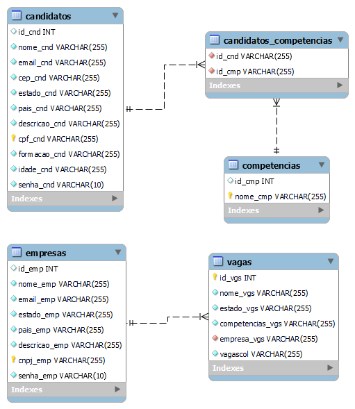

Esse é o projeto ZG-HERO da aplicação de Linketinder.

Até agora (update 11.04.2022):
- Backend em Groovy;
- Validação com testes unitários (JUnit);
- Frontend utilizando HTML, CSS e Typescript (puro) com Javascript transcrevido.
- Validação de cadastro de formulários usando Regex.
- Criação de database Linketinder usando PgAdmin4; (05.04)
- Modelagem de database usando o dbdiagram.io; (05.04)
- Correção de modelagem de database usando o MySql Workbench;
- Implementação de métodos CRUD para todas as tabelas;
- Pequenas correções nas classes PessoaFisica e PessoaJuridica;
- Criação da classe de Vagas;
- Upload de arquivos .txt detalhando a criação das tabelas e inserção de dados;
- Upload de arquivo .sql para criação de tabelas e inserção de dados (requisito do desafio que ficou faltando);
- Adição de Gradle.

