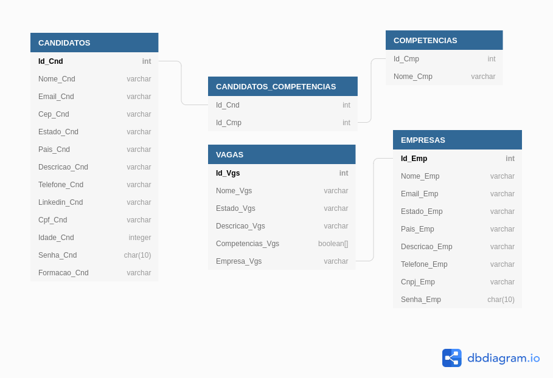

Esse é o projeto ZG-HERO da aplicação de Linketinder.

Até agora (update 05.04.2022):
- Backend em Groovy;
- Validação com testes unitários (JUnit);
- Frontend utilizando HTML, CSS e Typescript (puro) com Javascript transcrevido.
- Validação de cadastro de formulários usando Regex.
- Criação de database Linketinder usando PgAdmin4;
- Modelagem de database usando o dbdiagram.io.

